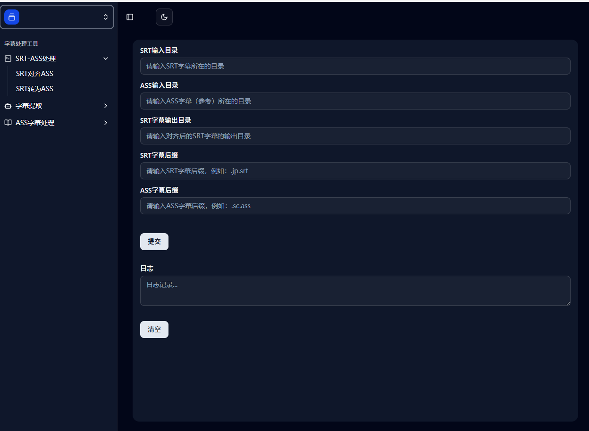

# 基于 React 和 Electron 的字幕处理桌面工具

因心血来潮，在五一假期期间的几天中，趁着空闲期间研究和学习 React 和 Electron，在基于 Python 和 PySide6 开发的工具[SubtitleCoder](https://github.com/liuweixu/SubtitleCoder)的基础上，使用 React 和 Electron 进行重构为可以安装的桌面应用软件。
原来是使用 Ant Design 和 Semi Design 组件库进行开发，但是最后感觉效果不太行，就改用 Shadcn-ui 组件库进行开发，并且编程语言改为 TypeScript。

这版本算是搞定了吧，未来一段时间有空就改改，顺便回忆前端知识点。

## 功能

### 已开发的功能

- 基于 Alass 对日语 SRT 字幕与对应的中文 ASS 字幕对齐
- 对 ASS 字幕进行各种处理
  - 修改 ScaledBorderAndShadow（涉及到字幕是否加粗和描边）
  - 修改目标样式对应的字体名称
  - 修改目标样式对应的样式信息
- 对 SRT 转换为相应的 ASS 字幕，并且可以自定义样式
- 从 MKV 视频或 ASS 字幕中提取相应的中文字幕或日语字幕
  - 从 ASS 双语字幕中提取中文或日语字幕
  - 从 MKV 视频中提取中文或日语字幕

## 技术栈

- React
  - 脚手架：React-Vite 版本：19.2.0
- Electron
- JavaScript
- Node.js
- TailwindCSS
- Shadcn-ui

## 安装和使用说明

### 脚手架

使用 React-Vite 脚手架进行开发，虽然 Create-React-App 脚手架虽然使用较为广泛，也容易入门，但是该脚手架存在不少问题：

- 被 React 官方宣布弃用和不再维护
- 不支持 SWC 编译器
- 和 TailWindCSS 不兼容
- 打包过于慢，在 Packaging 阶段打包中经常花费 10 分钟以上的时间
- 时常出现各种莫名其妙的问题

而 React-Vite 配置较为简单，配合 SWC 编译器（安装其脚手架中，可以选择安装 SWC 编译器，十分方便）可以快速打包，并且打包速度很快，打包体积相对来说比较小一些，可以支持 TailWindCSS，所以本次使用 React-Vite 脚手架进行开发。。

### 安装额外工具

- alass
- ffmpeg
- MKVToolNix
- [Visual Studio Build Tools](https://visualstudio.microsoft.com/zh-hans/visual-cpp-build-tools/)
  以上几个工具都是本项目所需要的，需要在电脑上安装，并且要加入环境变量中，最后一个因为 Electron 打包时，需要用到 Visual Studio 的一些工具。

### 安装依赖

```bash
# 使用 Vite 创建 React 项目，指定模板为 react，指定编程语言为TypeScript+SWC
npm create vite@latest
cd *** # 项目名称
# 安装 TailwindCSS
npm install tailwindcss @tailwindcss/vite
# 安装 Electron 和必要的工具
npm install electron electron-builder vite-plugin-electron --save-dev
# 安装 cross-env 用于跨平台环境变量设置
npm install cross-env --save-dev
# 安装wait-on
npm install wait-on npm-run-all --save-dev
```

参考文档：[shadcn-ui](https://ui.shadcn.com/docs/installation/vite)
以上是本项目所需要的依赖，具体的依赖版本可以查看 package.json 文件。

### 运行

```bash
# 开发
# 启动 React 开发服务器 和 Electron 主进程
npm run dev

# 打包
npm run electorn:build
```

上述启动命令是在 package.json 文件中配置的，具体见 scripts 字段。
目前 package.json 中只配置 win 的打包命令，如果需要，可以自行添加 mac 和 linux 的打包命令。
打包后，在 release 文件夹中可以找到打包好的 exe 文件，运行时可以直接安装和使用，也可以不用安装，只需要点击其中一个文件夹，里面也有 exe 文件，直接运行即可。

### 界面



## 详细教程与问题解决

有空就补上......

### 待练习的功能（如可行且有空时就应用开发）

- [x] 尝试新增背景图像（全局）
- [ ] 尝试新增背景图像（局部）
- [ ] 新增输入框的检验功能和提示功能，防止用户输入错误的内容
- [ ] 尝试使用 useEffect 和 Redux 等新的钩子函数。
- [x] 尝试使用 useRef 函数
- [ ] 尝试引入 Echart 等图标功能
- [x] 新增从本地选择文件夹的功能
- [x] 解决：选择文件夹的逻辑有一定的问题，即按清空或重置按钮时，依然没有清空相应位置，点击确认还能够继续运行。

## 感受

该桌面软件是我心血来潮，对 React 和 Electron 突然感兴趣，趁着五一假期有空的时候，就开始了学习和开发，但是因为开发时间很仓促，并且多次变更组件库，更换编程语言，所以该软件并不太成熟，界面并不是很完善，可能存在一些 bug，如果大家发现了 bug，可以在 issue 中或者通过邮件wei_xu_liu@163.com提出，我会尽快修复。

## 感谢

- [Shadcn-ui](https://ui.shadcn.com/)
- [Electron 官方教程](https://www.electronjs.org/zh/docs/latest/tutorial/tutorial-prerequisites)
- [TypeScript 菜鸟教程](https://www.runoob.com/typescript/ts-tutorial.html)
- [React 中文文档](https://react.docschina.org/)
- [Vite 官方文档](https://cn.vite.dev/guide/#scaffolding-your-first-vite-project) 涉及到 react-vite 的一些用法
- [黑马 React 笔记](https://blog.csdn.net/2301_80182418/article/details/145483587)
- [create-react-app 迁移到 vite 的教程](https://segmentfault.com/a/1190000044980287)
- [DeepSeek](https://chat.deepseek.com/) 感谢其解决我在 React 和 Electron 上碰到的问题。
- [Trae](https://www.trae.ai/) 主要开发工具
- [VScode](https://code.visualstudio.com/) 主要开发工具
